# KJ Framework - HybridCLR 接入指南与工作流程

本篇文档梳理了本项目中 HybridCLR 的接入流程图、相关设置项及生成文件的路径分布。项目的热更架构严格遵循“AOT壳（Launcher）”与“热更逻辑（Boot 及上层模块）”物理分离的设计。

## 1. 运行时加载流程图

启动加载流程是在 AOT 阶段完成资源的下载，再依次挂载 AOT Metadata 和加载热更 DLL，最后通过反射移交执行权给热更层。

```mermaid
sequenceDiagram
    participant Entry as AOT Entry (Boot/Main)
    participant BootLoader as BootLoader (AOT壳)
    participant YooAsset as YooAsset系统
    participant HybridCLR as HybridCLR.Runtime
    participant BootRunner as BootUpdateRunner (热更入口)
    participant Project as ProjectStartup (业务层)

    Entry->>BootLoader: 1. 启动游戏
    BootLoader->>YooAsset: 2. 初始化 YooAsset (DefaultPackage)
    
    rect rgb(30, 40, 50)
        Note over BootLoader,HybridCLR: 补充元数据加载阶段 (AOT Metadata)
        BootLoader->>YooAsset: 3. 读取 AOT Metadata DLL 字节流
        YooAsset-->>BootLoader: 返回 byte[]
        BootLoader->>HybridCLR: 4. LoadMetadataForAOTAssembly()
    end
    
    rect rgb(40, 50, 40)
        Note over BootLoader,HybridCLR: 热更程序集加载阶段 (HotUpdate DLLs)
        BootLoader->>YooAsset: 5. 读取 HotUpdate DLL 字节流
        YooAsset-->>BootLoader: 返回 byte[]
        BootLoader->>BootLoader: 6. Assembly.Load(byte[]) 加载热更代码
    end
    
    BootLoader->>BootRunner: 7. 反射调用 "Boot.BootUpdateRunner.Start()" (跨越AOT边界)
    BootRunner->>Project: 8. 执行真正的业务启动流程
```



## 2. 关键配置与设置项

为了使得自动化构建和运行时可以正确加载，在项目中进行了如下配置：

### 2.1 HybridCLR 官方配置 
*路径: `ProjectSettings/HybridCLRSettings.asset` (或通过顶部菜单 `HybridCLR -> Settings`)*
* **`hotUpdateAssemblies`**: 记录需要热更的程序集（例如：`Boot`, `Core`, `General`, `Project`, `Pool`, `Cache`, `Event`, `Asset`, `Log`, `RuntimeLog` 等）。**注意：绝对不能包含 `Launcher`**。
* **`patchAOTAssemblies`**: 记录需要泛型实例化的 AOT 程序集（生成补充元数据 DLL）。

### 2.2 Boot 场景启动配置
*路径: `Assets/GameRes/Scene/Boot/Main.unity` 中的 `Entry` 对象*
这里挂载了 `Entry` 脚本，其中的 `StartupSettings` (即 `BootStartupSettings`) 配置了：
* **`AotMetadataAssemblies`**: 包含了所有生成的元数据配置列表（AssemblyName 和对应的 AssetPath）。
* **`HotUpdateAssemblies`**: 包含了所有热更代码的配置列表。
* **`StartupTypeName` / `StartupMethodName`**: 指定加载完 Boot 后，业务的正式启动入口点（默认 `Project.Bootstrap.ProjectStartup, Project`，方法 `Start`）。

### 2.3 YooAsset 资源收集配置
*由 `KJHybridClrBuildTools.cs` 自动管理*
* 在 YooAsset 的收集器中，`HotUpdate` 组别内配置了针对 `Dlls` 目录和 `AotMetadata` 目录的收集规则，标记 `AssetTags` 为 `hotupdate`。
* 热更和元数据 DLL 使用原生的 `.bytes` 方式打包 (`PackRawFile`)，从而不需要以 Unity `TextAsset` 的形式存在。

## 3. 生成文件与存储位置

在使用顶部自动化菜单（`KJ -> HybridCLR -> Generate All Sync And Prepare Boot`）构建时，文件的生成和流转如下：

### 3.1 原始编译输出（HybridCLR 默认目录）
HybridCLR 编译后产生的临时文件默认位于项目根目录：
* **热更 DLL**：`HybridCLRData/HotUpdateDlls/<BuildTarget>/`
* **裁剪后的 AOT DLL（用于元数据）**：`HybridCLRData/AssembliesPostIl2CppStrip/<BuildTarget>/`

### 3.2 游戏资源目录（同步映射区）
我们的构建脚本 (`KJHybridClrBuildTools.cs`) 会自动将上述目录中的所需 DLL 拷贝至项目的 `Assets/GameRes` 中，并加上 `.bytes` 后缀，作为 YooAsset 可以打包的资产：
* **热更 DLL 资源**：`Assets/GameRes/HotUpdate/Dlls/`
* **补充元数据 资源**：`Assets/GameRes/HotUpdate/AotMetadata/`

打包时，YooAsset 就会将这部分资源作为初始资源或热更新资源打入包内。运行游戏时，`BootLoader` 直接从这里拉取二进制数据进行加载。

---

## 4. 构建打包管线（新增 — 2026-07-08）

以上 `KJ/HybridCLR/*` 菜单为**开发内循环**（Editor Play），不产出可运行的 Player 包。真正的"构建→打包→冒烟"走以下菜单：

### 4.1 菜单入口

| 菜单 | 用途 |
|------|------|
| `KJ → Build → Full Player Build & Validate` | 全量构建（清除所有标记，跑全部 Stage） |
| `KJ → Build → Incremental Player Build` | 增量构建（差量检测，仅重跑变更的 Stage） |
| `KJ → Build → Build Stage Manager...` | 可视化管理面板（自动检测+手动勾选） |
| `KJ → Build → Clear All Stage Markers` | 手动清除续跑标记 |

### 4.2 构建产物

- **Player**：`Build/Android/KJ.apk/launcher/build/outputs/apk/debug/launcher-debug.apk`
- **YooAsset 真包**：`Assets/StreamingAssets/DefaultPackage/`（Offline 模式）
- **报告**：`Build/Android/build_report.json` + `build_report.md`

### 4.3 ADB 测试流程

```bash
adb connect 127.0.0.1:7555                          # 连接 MuMu
adb install -r launcher-debug.apk                    # 安装
adb logcat -s Unity:V YooAsset:V Framework:V Boot:V  # 监听日志
```

### 4.4 相关文档

详见 `ProgressDoc/Discuss/Hy3_构建打包全流程管线_需求分析与设计.md`（设计文档 + 实施记录）。
